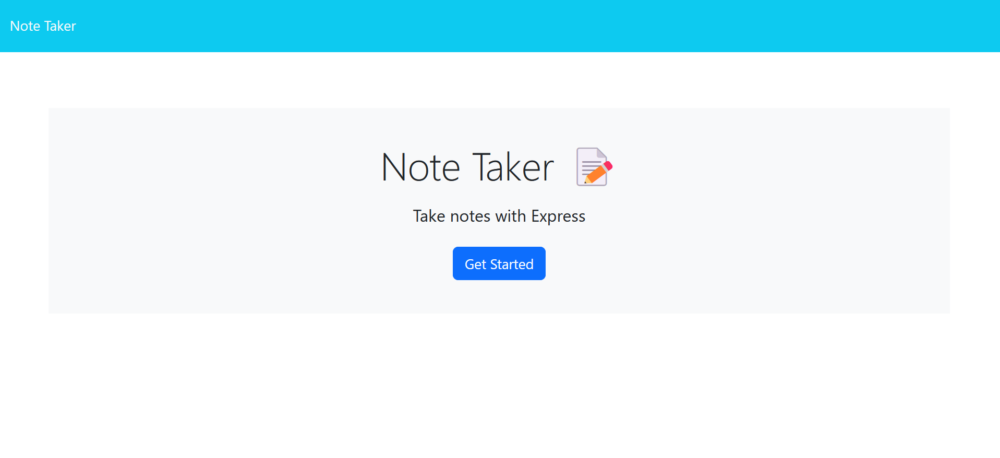
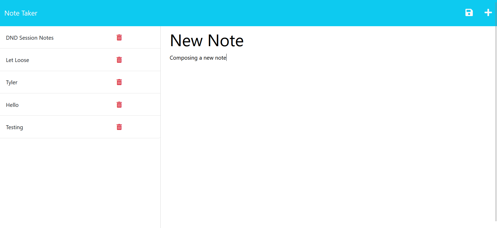
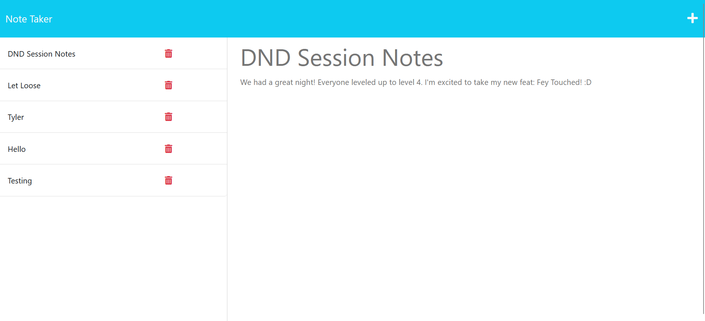

# Now That's What I call Notetaking!

### Upon Loading Application

### Generating a new note

### Viewing one of your previous notes

[Deployment Link](https://now-that-what-i-call-notetaking.onrender.com/)

---

## DESCRIPTION

Week 11 Challenger for Full-Stack Programming bootcamp at the University of Washington in partnership with edX. This note-taking application utilizes Express to create my own server to define various routes to view, add and delete notes. 

---

## INSTALLATION 

---

## USAGE

---

## CREDITS 

N/A

---

## LICENSE 

N/A